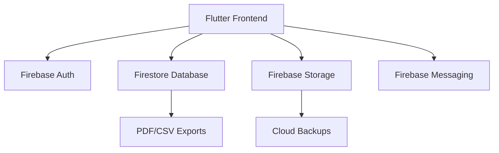

# 📚 EduTrack - Gestion Scolaire 📊

<p align="center">
  
</p>

<p align="center">
  <a href="https://flutter.dev/">
    
  </a>
  <a href="https://firebase.google.com/">
    
  </a>
  
  
</p>

## 📖 Description
Application mobile développée avec **Flutter** et **Firebase**, dédiée à la gestion académique des établissements scolaires. Elle permet aux enseignants et administrateurs de :

- Suivre les performances des étudiants
- Gérer les évaluations et notes
- Générer des rapports détaillés
- Faciliter la communication entre les parties prenantes

## ✨ Fonctionnalités Clés

### 👨‍🎓 Gestion des Étudiants
- Création et modification de profils étudiants
- Historique académique (années/semestres)
- Classement et statistiques par promotion

### 📝 Gestion des Notes
- Interface intuitive pour saisir les notes
- Coefficients personnalisables par matière
- Calcul automatique des moyennes générales et spécifiques
- Visualisation des performances via des graphiques dynamiques

### 📊 Tableaux de Bord
- Vue enseignant : suivi des classes, notifications
- Vue administrateur : gestion globale, alertes sur données manquantes
- Exportation des données en PDF ou CSV

### 🔐 Sécurité
- Authentification Firebase (rôles : Admin / Enseignant / Étudiant)
- Protection des données (chiffrement, règles de sécurité Firestore)
- Historique et journalisation des activités sensibles

## 🖼️ Captures d'Écran
<p align="center">
  <kbd>
    
    <em>Connexion sécurisée</em>
  </kbd>
  <kbd>
    
    <em>Tableau de bord</em>
  </kbd>
  <kbd>
    
    <em>Saisie des notes</em>
  </kbd>
</p>

## 🛠️ Architecture Technique


### 📦 Dépendances Principales
| Package Flutter | Utilisation |
|-----------------|------------|
| firebase_core | Initialisation Firebase |
| firebase_auth | Authentification utilisateur |
| cloud_firestore | Base de données temps réel |
| firebase_storage | Sauvegarde de fichiers |
| firebase_messaging | Notifications push |
| flutter_local_notifications | Notifications locales |
| file_picker | Importation de fichiers |
| path_provider | Accès fichiers locaux |
| share_plus | Partage de fichiers |
| multi_select_flutter | Sélections multiples |
| flutter_staggered_animations | Animations d’UI |
| salomon_bottom_bar | Barre de navigation personnalisée |

## 🚀 Installation

### Cloner le projet :
```bash
git clone https://github.com/votre-repo/edutrack.git
cd edutrack
```

### Installer les dépendances :
```bash
flutter pub get
```

### Configurer Firebase :
1. Créer un projet Firebase
2. Ajouter les fichiers `google-services.json` (Android) et `GoogleService-Info.plist` (iOS)
3. Vérifier que les règles Firestore sont sécurisées

### Lancer l'application :
```bash
flutter run
```

## 🤝 Contribution
1. Forker le projet
2. Créer une branche : `git checkout -b feature/ma-feature`
3. Commiter vos changements : `git commit -m "Ajout de ma feature"`
4. Pousser la branche : `git push origin feature/ma-feature`
5. Ouvrir une Pull Request

## 📄 Licence
Distribué sous licence **MIT**. Voir le fichier `LICENSE` pour plus d’informations.

## ✉️ Contact
**Dissang Kevin** - dissangfrancis@yahoo.com  
Lien du projet : [Projetc Link](https://github.com/kteken10/flutter_school_app)

